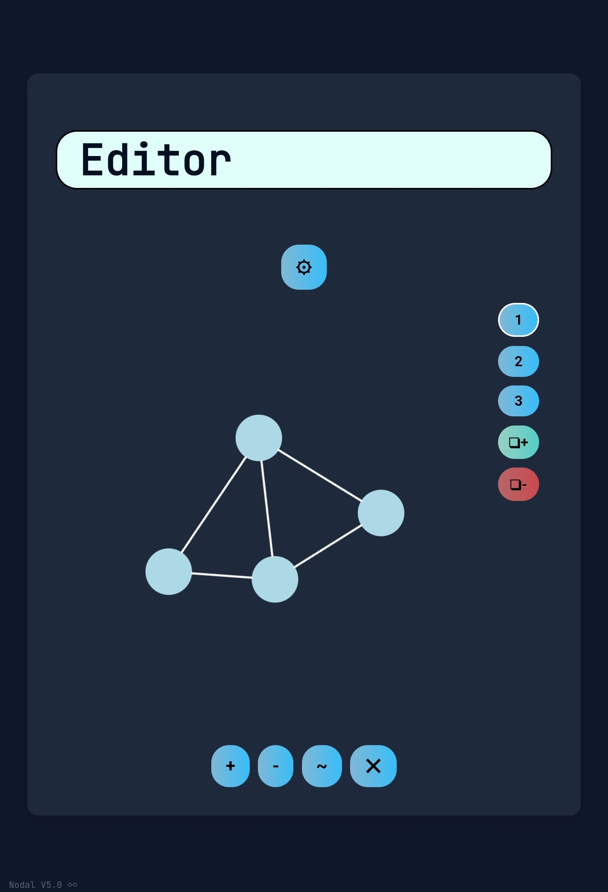

# Latest Project

This is Nodal, its either a free graphing app(since most ive seen are subscription-based) or a **pico-LLM editor**, able to create simple neural networks by dragging nodes and setting parameters manually.
Or use... No, that shall be secret for now, just in case.
This will most likely flop, since why would anybody torture themselves? That is why it has multiple goals, just in case.

Documentation for this project is in
`Files/Nodal/documentation.md`

Wiki for this project - [**Nodal Wiki**](https://github.com/EmfSCPP/emfscpp.github.io/wiki)